## Part 1. Установка OC
###### Установи Ubuntu 20.04 Server LTS без графического интерфейса. (Используем программу для виртуализации - VirtualBox).
* Версия убунту\
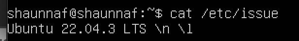
## Part 2 Создание пользователя
###### Создай пользователя, отличного от созданного при установке. Пользователь должен быть добавлен в группу adm.
* Создание нового пользователя\

* Вывод команды "cat /etc/passwd"\
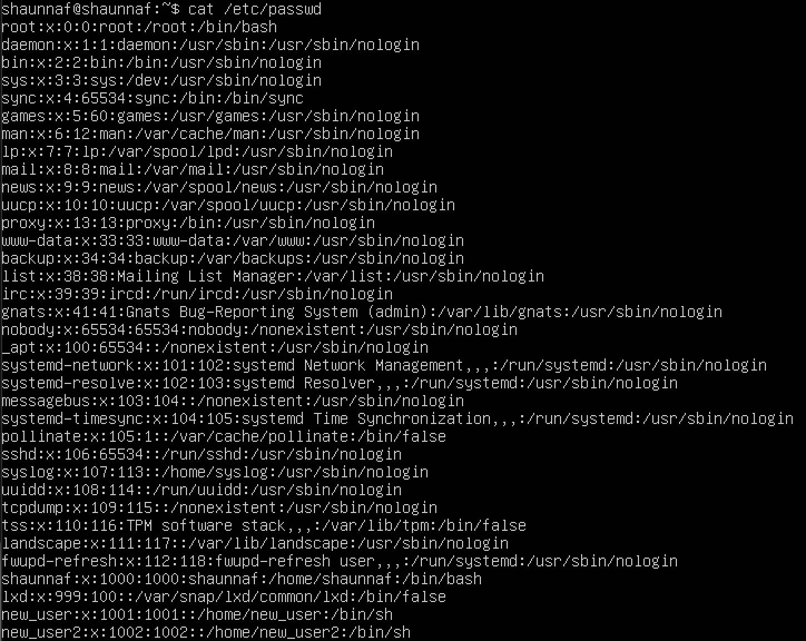
## Part 3 Настройка сети ОС
1. ###### Задай название машины вида user-1.
* Смена названия машины происходит путем изменения содержимого двух файлов. 1 файл:\
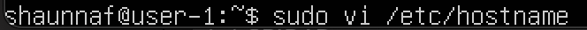
* Содержимое первого файла\
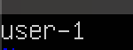
* Второй файл:\
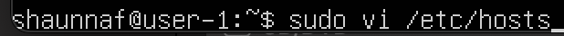
* Содержимое второго файла\
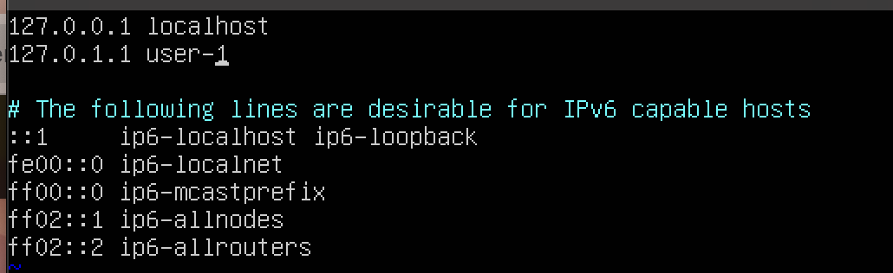
2. ###### Установи временную зону, соответствующую твоему текущему местоположению.
* Установка часового пояса\

3. ###### Выведи названия сетевых интерфейсов с помощью консольной команды.
* Используемые сетевые интерфейсы\
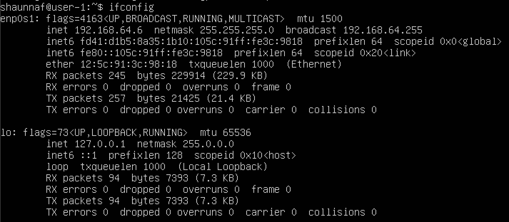
* Сетевой интерфейс `lo` - виртуальный интерфейс который используется для отладки сетевых программ и запуска серверных приложений на локальной машине.
4. ###### Используя консольную команду, получи ip адрес устройства, на котором ты работаешь, от DHCP сервера.
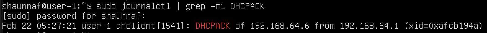
* Dynamic Host Configuration Protocol(DHCP) — протокол динамической настройки узла.
5. ###### Определи и выведи на экран внешний ip-адрес шлюза (ip) и внутренний IP-адрес шлюза, он же ip-адрес по умолчанию (gw).
* Внутренний ip-адрес шлюза\
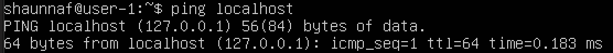
* Внешний ip-адрес шлюза\
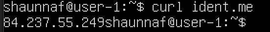
6. ###### Задай статичные (заданные вручную, а не полученные от DHCP сервера) настройки ip, gw, dns (используй публичный DNS серверы, например 1.1.1.1 или 8.8.8.8).
* Открываем файл настройки ip\
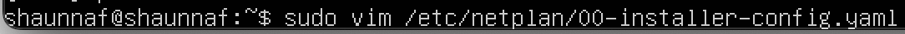
* Прописываем настройки\
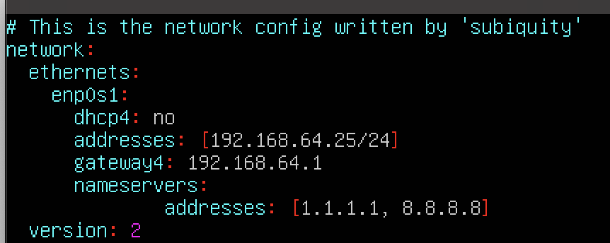
7. ###### Перезагрузи виртуальную машину. Убедись, что статичные сетевые настройки (ip, gw, dns) соответствуют заданным в предыдущем пункте.
* Перезагружаем машину и пингуем `1.1.1.1` и `ya.ru`
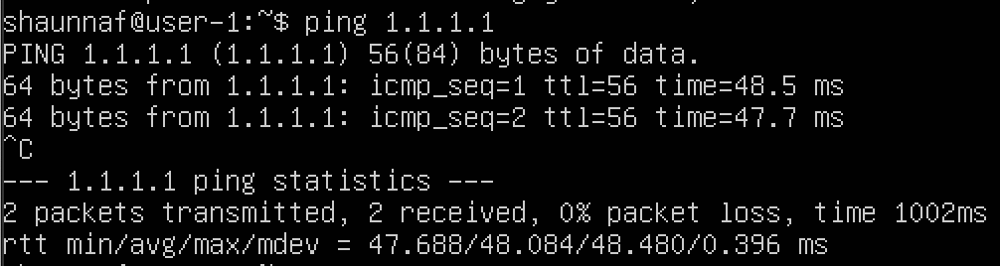

## Part 4 Обновление ОС
###### Обнови системные пакеты до последней на момент выполнения задания версии.
* Выполняем две команды `sudo apt update` и `sudo apt upgrade`
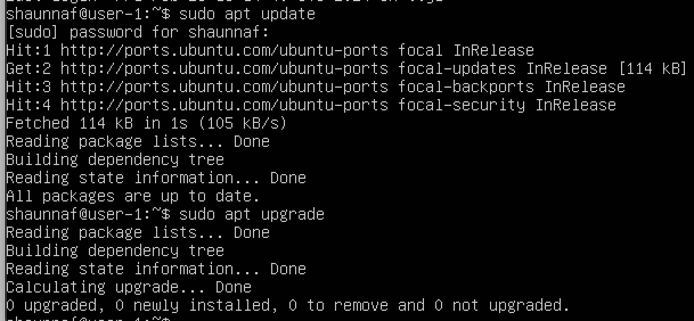
## Part 5 Использование команды sudo
###### Разреши пользователю, созданному в Part 2,выполнять команду sudo.
* Выполняем команду `sudo adduser <имя пользователя> sudo`
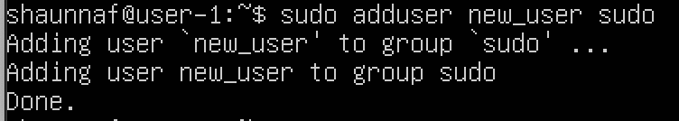
## Part 6 Установка и настройка службы времени.
###### Настрой службу автоматической синхронизации времени.
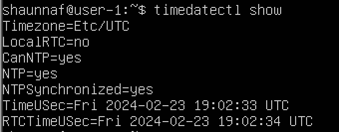
## Part 7. Установка и использование текстовых редакторов
###### Установи текстовые редакторы VIM (+ любые два по желанию NANO, MCEDIT, JOE и т.д.)
1. ###### Используя каждый из трех выбранных редакторов, создай файл test_X.txt, где X -- название редактора, в котором создан файл. Напиши в нём свой никнейм, закрой файл с сохранением изменений.
###### VIM
* Для выхода нужно прописать `:wq`\
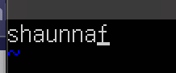
###### NANO
* Для выхода нужно нажать комбинацию на клавиатуре `ctrl+x` и нажать `y` для сохранения изменений\
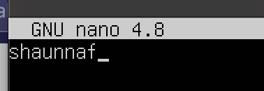
###### MCEDIT
* Сначала нужно установить mcedit:\

* Для выхода нужно нажать на клавиатуре `F10` и выбрать `Yes` для сохранения изменений\
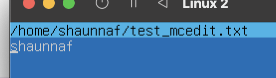
2. ###### Используя каждый из трех выбранных редакторов, открой файл на редактирование, отредактируй файл, заменив никнейм на строку «21 School 21», закрой файл без сохранения изменений.
###### VIM
* Для выхода нужно прописать `:q!`\
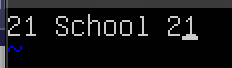
###### NANO
* Для выхода нужно нажать комбинацию на клавиатуре `ctrl+x` и нажать `n` для отмены изменений\
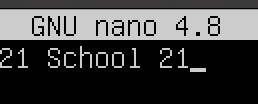
###### MCEDIT
* Для выхода нужно нажать на клавиатуре `F10` и выбрать `No` для отмены изменений\
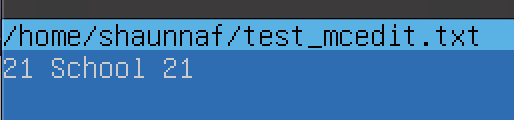
3. ###### Используя каждый из трех выбранных редакторов, отредактируй файл ещё раз (по аналогии с предыдущим пунктом), а затем освой функции поиска по содержимому файла (слово) и замены слова на любое другое.
###### VIM
* Поиск слова:\
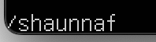
* Замена слова:\

###### NANO
* Поиск слова: используем комбинацию клавиш `Ctrl+w` и вводим искомое слово\

* Замена слова:
  1. Используем комбинацию клавиш `Ctrl+\` и вводим заменяемое слово\

  2. Вводим слово на которое хотим заменить\

  3. Подтверждаем изменения\
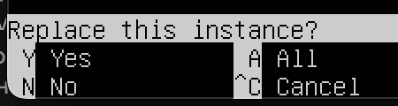
###### MCEDIT
* Для поиска нажимаем клавишу `F7` и вводим искомое слово\
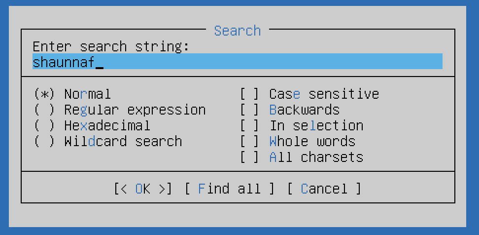
* Для замены нажимаем клавишу `F4` и вводим искомое слово и чем мы его хотим заменить и подтверждаем изменения\
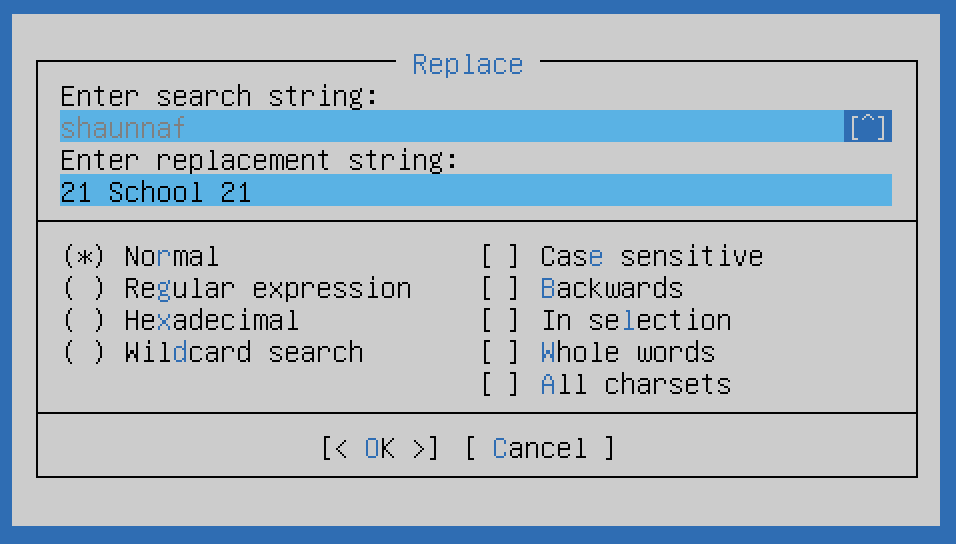
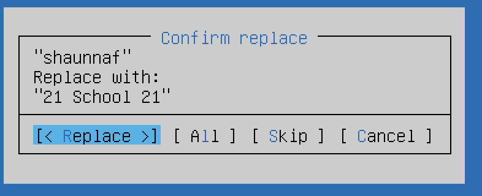
## Part 8 Установка и базовая настройка сервиса SSHD
1. ###### Установи службу SSHd.
* Прописываем команды\

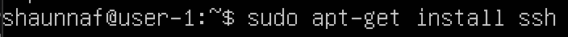\
2. ###### Добавь автостарт службы при загрузке системы.
* Включаем автостарт ssh при каждом запуске системы\
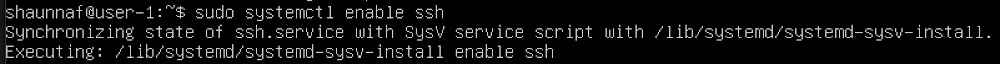
3. ###### Перенастрой службу SSHd на порт 2022.
* Добавляем в файл `/etc/ssh/sshd_config` строчку `port 2022`\
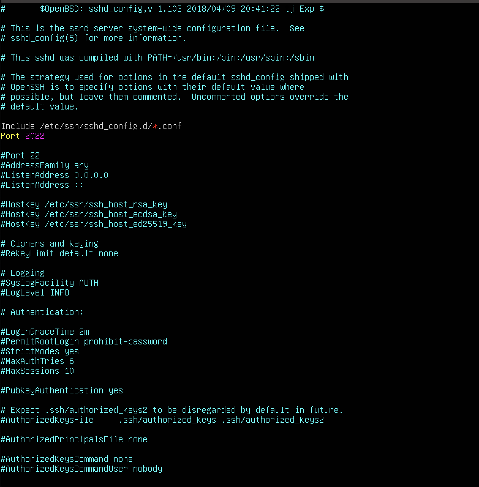
* Для того чтобы изменения вступили в силу нужно прописать `sudo systemctl restart ssh`\

4. ###### Используя команду ps, покажи наличие процесса sshd. Для этого к команде нужно подобрать ключи.
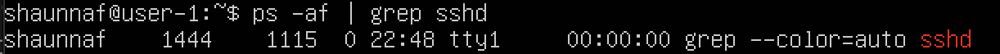
* Команда `ps` - запущенные процессы на сервере
* Флаг `-a` показывает все процессы
* Флаг `-f` выводит максимум доступных данных
5. ###### Перезагрузи систему.
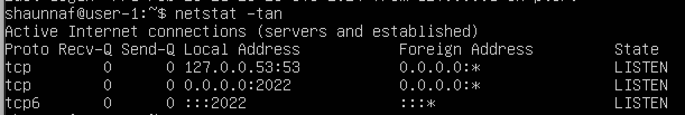
* netstat(network statistics) - утилита командной строки, выводящая на дисплей состояние TCP-соединений
* Флаг `-t` показывает tcp порты
* Флаг `-a` показывает состояние всех сокетов
* Флаг `-n` показывает сетевые адреса как числа
* `0.0.0.0` в выводе netstat означает, что ssh прослушивает все интерфейсы IPv4, которые есть у машины
## Part 9. Установка и использование утилит top, htop
###### top
* uptime\
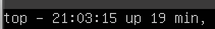
* Количество авторизованных пользователей\
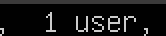
* Общая загрузка системы\
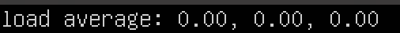
* Общее количество процессов\
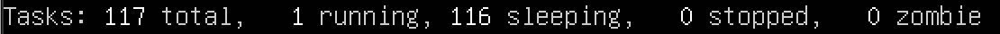
* Загрузка cpu\
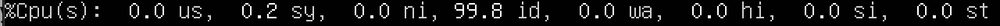
* Загрузка памяти\
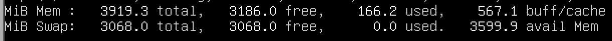
* pid процесса занимающего больше всего памяти
* При помощи комбинации `shift+m` сортируем таблицу по памяти в порядке убывания
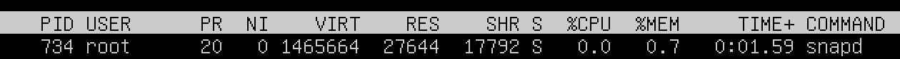
* pid процесса, занимающего больше всего процессорного времени
* При помощи комбинации `shift+t` сортируем таблицу по процессорному времени в порядке убывания
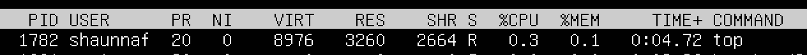
###### htop
* Сортировка происходит после нажатия `f6` и выбора критерия сортировки:
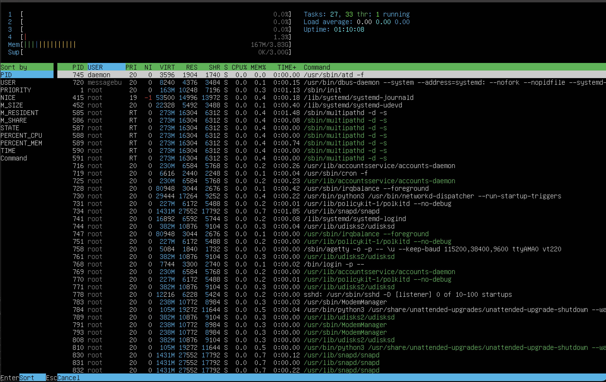
* Сортировка по:
1. PID\
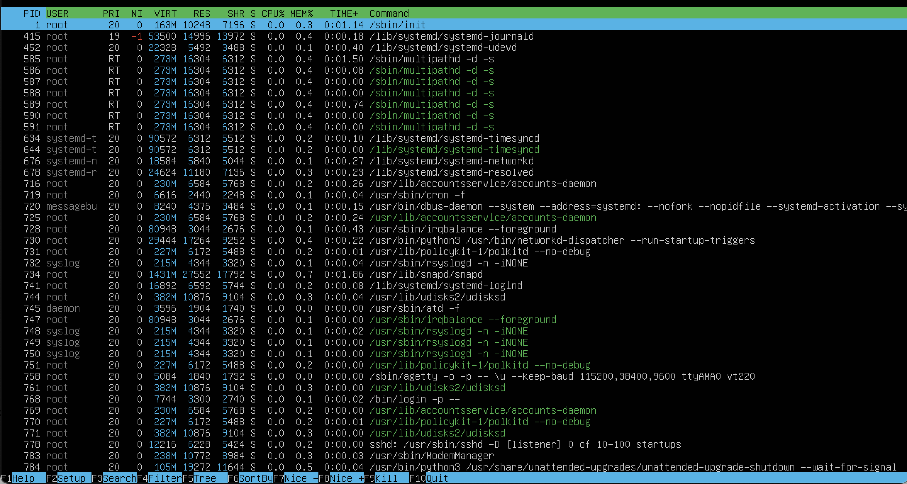
2. PERCENT_CPU\
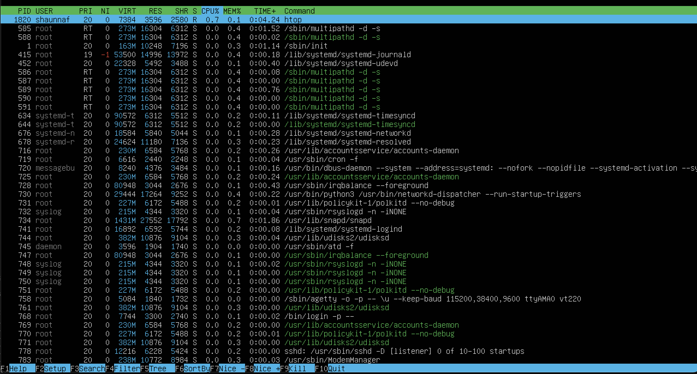
3. PERCENT_MEM\
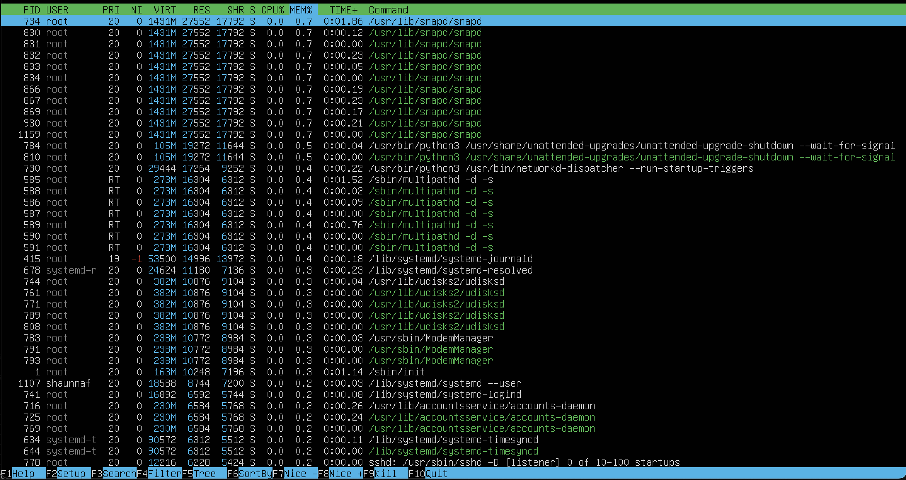
4. TIME\
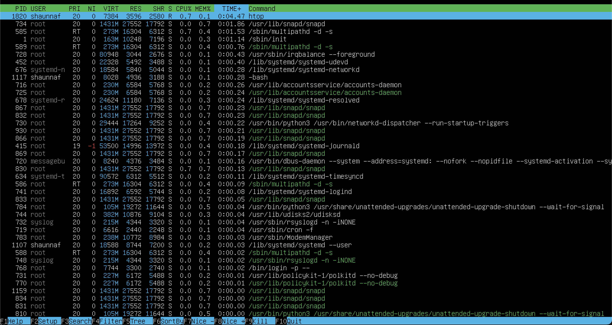
* Отфильтрованному по sshd:(после нажатия `f4`)\
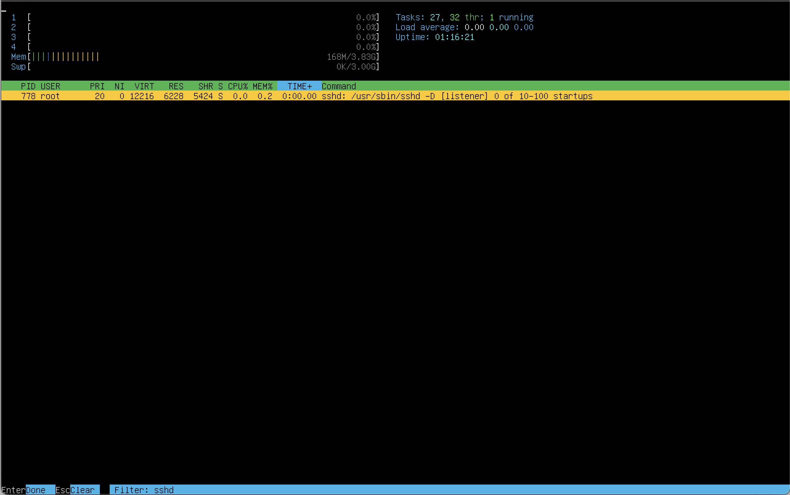
* C процессом syslog, найденным, используя поиск:(после нажатия `f3`)\
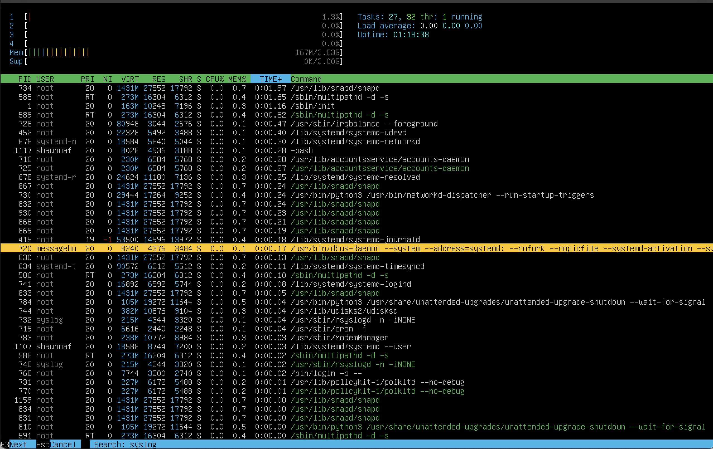
* с добавленным выводом hostname, clock и uptime(после нажатия `f2` выбираем нужные нам колонки)\
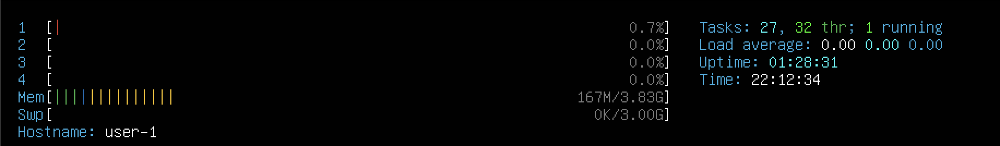
## Part 10. Использование утилиты fdisk.
###### Запусти команду fdisk -l.
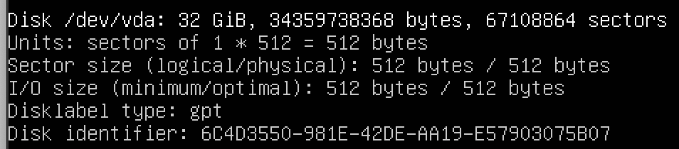
* Размер Swap:\

## Part 11. Использование утилиты df.
###### Запусти команду df.
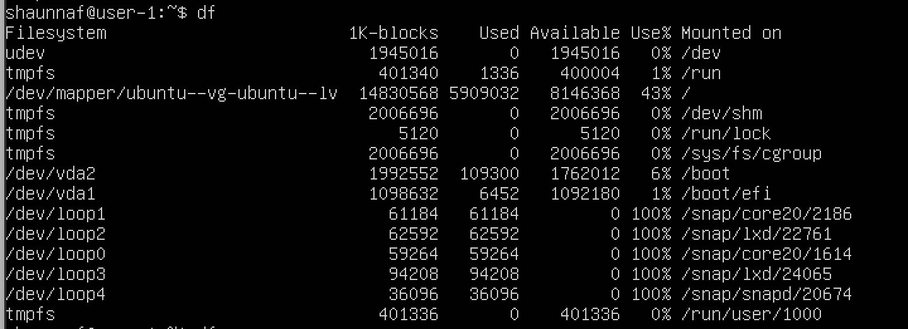
* Размер раздела

* Размер занятого пространства

* Размер свободного пространства

* Процент использования

* В отчете вся размерность указана в киллобайтах
###### Запусти команду df -Th.

* Размер раздела

* Размер занятого пространства

* Размер свободного пространства

* Процент использования

* В отчете вся размерность указана в гигабайтах
## Part 12. Использование утилиты du.
###### Запусти команду du

###### Выведи размер папок /home, /var, /var/log (в байтах, в человекочитаемом виде)


###### Выведи размер всего содержимого в /var/log (не общее, а каждого вложенного элемента, используя *)

## Part 13. Установка и использование утилиты ncdu.
###### Установи утилиту ncdu.

###### Выведи размер папок /home, /var, /var/log


## Part 14. Работа с системными журналами.
###### Открой для просмотра:
* 1. /var/log/dmesg:

* 2. /var/log/syslog

* 3. /var/log/auth.log

* Напиши в отчёте время последней успешной авторизации, имя пользователя и метод входа в систему:

* Перезапусти службу SSHd и вставь в отчёт скрин с сообщением о рестарте службы (искать в логах).

## Part 15. Использование планировщика заданий CRON.
###### Используя планировщик заданий, запусти команду uptime через каждые 2 минуты
Открываем файл планировщика при помощи команды `crontab -e` и пишем туда `*/2 * * * * uptime`\

В файле `/var/log/systemlog` видим изменения файла планировщика\

###### Удали все задания из планировщика заданий.
При помощи команды `crontab -r` удалям все задания из планировщика\
\
Проверяем текущие задачи планировщика\


