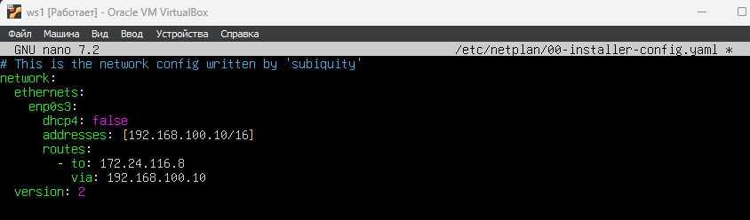
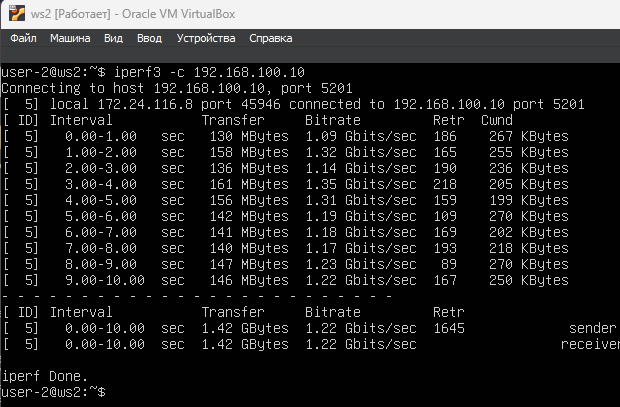
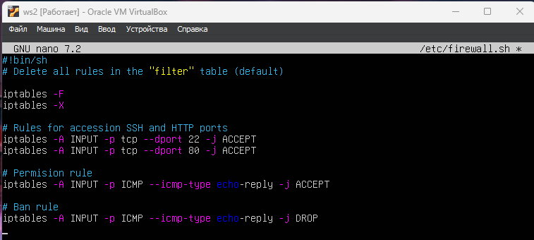
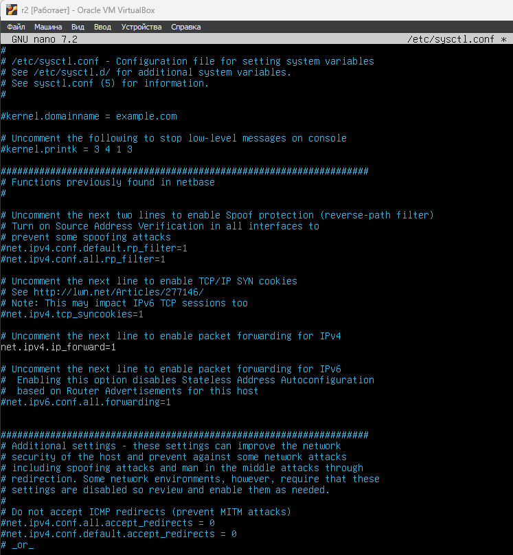
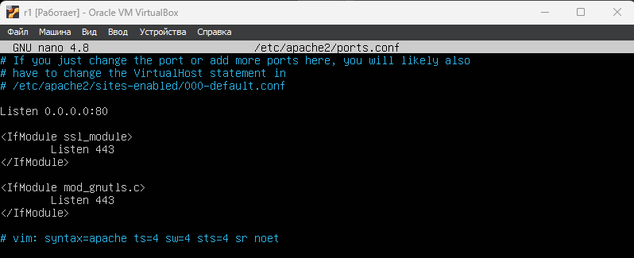
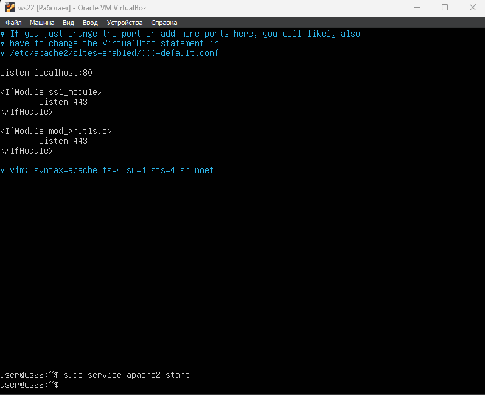

# Сети в Linux

Настройка сетей в Linux на виртуальных машинах.

## Part 1. Инструмент **ipcalc**

**== Задание ==**

##### Подними виртуальную машину (далее -- ws1)

#### 1.1. Сети и маски
##### Определи и запиши в отчёт:
##### 1) Адрес сети *192.167.38.54/13*
\
Адрес сети `192.167.38.54/13` - строка Network, а именнно `192.160.0.0`

##### 2) Перевод маски *255.255.255.0* в префиксную и двоичную запись, */15* в обычную и двоичную, *11111111.11111111.11111111.11110000* в обычную и префиксную
- В маске 255.255.255.0 перые три октета (каждый по 8 бит), установлены в 1, последний октет (также в 8 бит) установлен в 0. => маска 255.255.255.0 в сумме содержит 24 бита (префиксная запись)\
Запишем это: *255.255.255.0* => /24 => 11111111.11111111.11111111.00000000

- Префикс /15 означает, что первые 15 бит адреса установлены в 1, а остальные в 0.
/15 => 11111111.11111110.0.0 => 255.254.0.0

- 11111111.11111111.11111111.11110000 - содержит 28 установленных битов => префиксная запись будет выглядить как /28, а обычная - 255.255.255.240

##### 3) Минимальный и максимальный хост в сети *12.167.38.4* при масках: */8*, *11111111.11111111.00000000.00000000*, *255.255.254.0* и */4*


#### 1.2. localhost
##### Определи и запиши в отчёт, можно ли обратиться к приложению, работающему на localhost, со следующими IP: *194.34.23.100*, *127.0.0.2*, *127.1.0.1*, *128.0.0.1*
\
=> из этого можно понять, что обратиться к приложению по адресу 127.0.0.1 можно находясь только вместе с ним в одной сети.

`194.34.23.100` - нет, поскольку адрес сети 127.0.0.0

`127.0.0.2` -да, поскольку они в одной сети

`127.1.0.1` - да, поскольку они в одной сети

`128.0.0.1` - нет, потому что адрес сети 127.0.0.0

#### 1.3. Диапазоны и сегменты сетей
##### Определи и запиши в отчёт:
##### 1) Какие из перечисленных IP можно использовать в качестве публичного, а какие только в качестве частных: *10.0.0.45*, *134.43.0.2*, *192.168.4.2*, *172.20.250.4*, *172.0.2.1*, *192.172.0.1*, *172.68.0.2*, *172.16.255.255*, *10.10.10.10*, *192.169.168.1*

`Частные` - *10.0.0.45*, *172.20.250.4* *192.168.4.2*, *172.16.255.255*, *10.10.10.10*

соответственно `публичными` могут быть:

*134.43.0.2*, *172.0.2.1*, *192.172.0.1*, *172.68.0.2*, *192.169.168.1*

##### 2) Какие из перечисленных IP адресов шлюза возможны у сети *10.10.0.0/18*: *10.0.0.1*, *10.10.0.2*, *10.10.10.10*, *10.10.100.1*, *10.10.1.255*

*10.0.0.1* - Нет

*10.10.0.2* - Да 

*10.10.10.10* - Да

*10.10.100.1* - Нет

*10.10.1.255* - Да

## Part 2. Статическая маршрутизация между двумя машинами
**== Задание ==**

##### Подними две виртуальные машины (далее -- ws1 и ws2).

##### С помощью команды `ip a` посмотри существующие сетевые интерфейсы.
- В отчёт помести скрин с вызовом и выводом использованной команды.

Результат использования команды `ip a`  для `ws1`


Результат использования команды `ip a`  для `ws2` 


##### Опиши сетевой интерфейс, соответствующий внутренней сети, на обеих машинах и задать следующие адреса и маски: ws1 - *192.168.100.10*, маска */16*, ws2 - *172.24.116.8*, маска */12*.

- В отчёт помести скрины с содержанием изменённого файла *etc/netplan/00-installer-config.yaml* для каждой машины.

Меняем `etc/netplan/00-installer-config.yaml` на `ws1:`\
\
Затем меняем `etc/netplan/00-installer-config.yaml` на `ws2:`\


##### Выполни команду `netplan apply` для перезапуска сервиса сети.
- В отчёт помести скрин с вызовом и выводом использованной команды.

Применяем `netplan apply` для перезапуска сервиса сети\
\

#### 2.1. Добавление статического маршрута вручную
##### Добавь статический маршрут от одной машины до другой и обратно при помощи команды вида `ip r add`.
##### Пропингуй соединение между машинами.
- В отчёт помести скрин с вызовом и выводом использованных команд.

На машине `ws1` добавляем статический маршрут к машине `ws2`:\
\
На машине `ws2` добавляем статический маршрут к машине ws1:\


На машине `ws1` пингуем соединение с `ws2` (172.24.116.8)\
\
Точно так же пингуем `ws2` с `ws1`(192.168.100.10):\


#### 2.2. Добавление статического маршрута с сохранением
##### Перезапусти машины.
##### Добавь статический маршрут от одной машины до другой с помощью файла *etc/netplan/00-installer-config.yaml*.
- В отчёт помести скрин с содержанием изменённого файла *etc/netplan/00-installer-config.yaml*.

Добавляем статичский маршрут от `ws1` до `ws2` с помощью файла  `etc/netplan/00-installer-config.yaml`\
\
Точно так же делаем и для `ws2`:\

##### Пропингуй соединение между машинами.
- В отчёт помести скрин с вызовом и выводом использованной команды.

Обязательно применяем изменения на обоих машинах перед тем как пинговать\
Пингуем на первой машине:\
\
Пингуем на второй машине:\

## Part 3. Утилита **iperf3**
**== Задание ==**

*В данном задании используются виртуальные машины ws1 и ws2 из Части 2*

#### 3.1. Скорость соединения
##### Переведи и запиши в отчёт: 8 Mbps в MB/s, 100 MB/s в Kbps, 1 Gbps в Mbps.

1) 8 Mbps(Мегабит/с) = (8 / 8) MB/s = 1 MB/s (МегаБайт/с)

2) 100 MB/s (Мегабайт/с) = (100 * 8000) Kbps = 800000 (Kbps) КилоБит

3) 1 ГигаБит (Gbps)= 1000 МегаБит (Mbps)

#### 3.2. Утилита **iperf3**
##### Измерь скорость соединения между ws1 и ws2.
- В отчёт помести скрины с вызовом и выводом использованных команд.

Измеряем скорость соединения между `ws1` и `ws2`:\
\


## Part 4. Сетевой экран
**== Задание ==**

*В данном задании используются виртуальные машины ws1 и ws2 из Части 2*

#### 4.1. Утилита **iptables**
##### Создай файл */etc/firewall.sh*, имитирующий фаерволл, на ws1 и ws2:
```shell
#!/bin/sh

# Удаление всех правил в таблице «filter» (по-умолчанию).
iptables -F
iptables -X
```
##### Нужно добавить в файл подряд следующие правила:
##### 1) На ws1 примени стратегию, когда в начале пишется запрещающее правило, а в конце пишется разрешающее правило (это касается пунктов 4 и 5).
##### 2) На ws2 примени стратегию, когда в начале пишется разрешающее правило, а в конце пишется запрещающее правило (это касается пунктов 4 и 5).
##### 3) Открой на машинах доступ для порта 22 (ssh) и порта 80 (http).
##### 4) Запрети *echo reply* (машина не должна «пинговаться», т.е. должна быть блокировка на OUTPUT).
##### 5) Разреши *echo reply* (машина должна «пинговаться»).
- В отчёт помести скрины с содержанием файла */etc/firewall* для каждой машины.
##### Запусти файлы на обеих машинах командами `chmod +x /etc/firewall.sh` и `/etc/firewall.sh`.
- В отчёт помести скрины с запуском обоих файлов;
- В отчёте опиши разницу между стратегиями, применёнными в первом и втором файлах.

Измененный `/etc/firewall.sh` для машины ws1\
\
Измененный `/etc/firewall.sh` для машины ws2\
\
Запуск обоих файлов:\
\
\

Правила выполняться сверху-вниз, следовательно, если правило запрета находиться выше, оно срабатывает, а разрешающее правило, находящееся ниже, нет.
Если сначала пишутся запрещающие правила, то они НЕ перезаписываются разрешающими.
#### 4.2. Утилита **nmap**
##### Командой **ping** найди машину, которая не «пингуется», после чего утилитой **nmap** покажи, что хост машины запущен.
*Проверка: в выводе nmap должно быть сказано: `Host is up`*.
- В отчёт помести скрины с вызовом и выводом использованных команд **ping** и **nmap**.

Проверяем, что хост второй машины запущен, но не пингуется\
\

##### Сохрани дампы образов виртуальных машин
**P.S. Ни в коем случае не сохраняй дампы в гит!**


## Part 5. Статическая маршрутизация сети
**== Задание ==**
##### Подними пять виртуальных машин (3 рабочие станции (ws11, ws21, ws22) и 2 роутера (r1, r2)).

#### 5.1. Настройка адресов машин
##### Настрой конфигурации машин в *etc/netplan/00-installer-config.yaml* согласно сети на рисунке.
\
- В отчёт помести скрины с содержанием файла *etc/netplan/00-installer-config.yaml* для каждой машины.
##### Перезапусти сервис сети. Если ошибок нет, то командой `ip -4 a` проверь, что адрес машины задан верно. Также пропингуй ws22 с ws21. Аналогично пропингуй r1 с ws11.
- В отчёт помести скрины с вызовом и выводом использованных команд.

`ws11`: результат отображения файла etc/netplan/00-installer-config.yaml и ипользование комады `ip -4 a` для проверки корректности адреса:\
\
`r1`: результат отображения файла etc/netplan/00-installer-config.yaml и ипользование комады `ip -4 a` для проверки корректности адреса:\
\
`r2`: результат отображения файла etc/netplan/00-installer-config.yaml и ипользование комады `ip -4 a` для проверки корректности адреса:\
\
`ws22`: результат отображения файла etc/netplan/00-installer-config.yaml и ипользование комады `ip -4 a` для проверки корректности адреса:\
\
`ws21`: результат отображения файла etc/netplan/00-installer-config.yaml и ипользование комады `ip -4 a` для проверки корректности адреса:\
\
Пропингуем ws22 с ws21:\
\
Пропингуем r1 с ws11:\
\

#### 5.2. Включение переадресации IP-адресов
##### Для включения переадресации IP, выполни команду на роутерах:
`sysctl -w net.ipv4.ip_forward=1`
*При таком подходе переадресация не будет работать после перезагрузки системы.*
*При использовании этого подхода, IP-переадресация включена на постоянной основе.*
Включение переадресации IP на роутерах с помощью команды `sysctl -w net.ipv4.ip_forward = 1`
- В отчёт помести скрин с вызовом и выводом использованной команды.
##### Открой файл */etc/sysctl.conf* и добавь в него следующую строку:
`net.ipv4.ip_forward = 1`

На роуntрах выполняем команду `sysctl -w net.ipv4.ip_forward = 1`:\


- В отчёт помести скрин с содержанием изменённого файла */etc/sysctl.conf*.

Файл `/etc/sysctl.conf` с добавленной строкой `net.ipv4.ip_forward = 1:` для r1:\
\
Файл `/etc/sysctl.conf` с добавленной строкой `net.ipv4.ip_forward = 1:` для r2:\

#### 5.3. Установка маршрута по-умолчанию
Пример вывода команды `ip r` после добавления шлюза:
```
default via 10.10.0.1 dev eth0
10.10.0.0/18 dev eth0 proto kernel scope link src 10.10.0.2
```
##### Настрой маршрут по-умолчанию (шлюз) для рабочих станций. Для этого добавь `default` перед IP роутера в файле конфигураций.
- В отчёт помести скрин с содержанием файла *etc/netplan/00-installer-config.yaml*;

Скрины etc/netplan/00-installer-config.yaml:
1) `ws11 netplan`:\

2) `ws21 netplan`:\

3) `ws22 netplan`:\


##### Вызови `ip r` и покажи, что добавился маршрут в таблицу маршрутизации.
- В отчёт помести скрин с вызовом и выводом использованной команды.

1) Результат выполнения `ip r` для ws11:\

2) Результат выполнения `ip r` для ws21\

3) Результат выполнения `ip r` для ws22\


##### Пропингуй с ws11 роутер r2 и покажи на r2, что пинг доходит. Для этого используй команду:
`tcpdump -tn -i eth0`
- В отчёт помести скрин с вызовом и выводом использованных команд.

Запускаем команду `tcpdump -tn -i eth0` на r2, параллельно пингуем на ws11 и видим, что пинг доходит:\


#### 5.4. Добавление статических маршрутов
##### Добавь в роутеры r1 и r2 статические маршруты в файле конфигураций. Пример для r1 маршрута в сетку 10.20.0.0/26:
```shell
# Добавь в конец описания сетевого интерфейса eth1:
- to: 10.20.0.0
  via: 10.100.0.12
```
- В отчёт помести скрины с содержанием изменённого файла *etc/netplan/00-installer-config.yaml* для каждого роутера.
##### Вызови `ip r` и покажи таблицы с маршрутами на обоих роутерах. Пример таблицы на r1:
```
10.100.0.0/16 dev eth1 proto kernel scope link src 10.100.0.11
10.20.0.0/26 via 10.100.0.12 dev eth1
10.10.0.0/18 dev eth0 proto kernel scope link src 10.10.0.1
```
Изменяем фалй `*etc/netplan/00-installer-config.yaml*` для r1, а именно добавляем статические маршруты, затем перезапускаем сервис сети и вызываем команду `ip r`:\
\
Изменяем фалй `*etc/netplan/00-installer-config.yaml*` для r2, а именно добавляем статические маршруты, затем перезапускаем сервис сети и вызываем команду `ip r`:\


##### Запусти команды на ws11:
`ip r list 10.10.0.0/[маска сети]` и `ip r list 0.0.0.0/0`
- В отчёт помести скрин с вызовом и выводом использованных команд;
- В отчёте объясни, почему для адреса 10.10.0.0/\[маска сети\] был выбран маршрут, отличный от 0.0.0.0/0, хотя он попадает под маршрут по-умолчанию.

Испольование `ip r list 10.10.0.0/[маска сети]` и `ip r list 0.0.0.0/0` на ws11:\
\
Для адреса 10.10.0.0/18 был выбран маршрут, отличный от 0.0.0.0/0, поскольку маршрутизатор выбирает маршрут с «самой длинной маской», поскольку это более точное решение. По этому правилу маршрут по умолчанию никогда не будет выбран, если есть альтернативные решения.


#### 5.5. Построение списка маршрутизаторов
Пример вывода утилиты **traceroute** после добавления шлюза:
```
1 10.10.0.1 0 ms 1 ms 0 ms
2 10.100.0.12 1 ms 0 ms 1 ms
3 10.20.0.10 12 ms 1 ms 3 ms
```
##### Запусти на r1 команду дампа:
`tcpdump -tnv -i eth0`
##### При помощи утилиты **traceroute** построй список маршрутизаторов на пути от ws11 до ws21.
- В отчёт помести скрины с вызовом и выводом использованных команд (tcpdump и traceroute);
- В отчёте, опираясь на вывод, полученный из дампа на r1, объясни принцип работы построения пути при помощи **traceroute**.

Результат отображения команд traceroute и tcpdump:\
\
\
Traceroute - это инструмент для определения маршрута от отправителя к получателю, который использует UDP-пакеты вместо ICMP-запросов. Он отправляет 3 UDP-пакета на определенный порт целевого хоста и ожидает ответа о недоступности этого порта, каждый пакет отправляется с увеличивающимся значением TTL (Время жизни пакета), первый пакет отправляется с TTL=1, второй с TTL=2 и так далее, пока запрос не попадёт адресату. Так как вместо ICMP-запроса он отправляет UDP-запрос, в каждом запросе есть порт отправителя и порт получателя. По умолчанию Traceroute использует порт 34434 для отправки UDP-пакетов. Когда пакет достигает целевого хоста, и его порт недоступен, хост отправляет ответ "Destination port unreachable" (порт назначения недоступен), что позволяет Traceroute завершить трассировку. Это значит, что адресат получил запрос.

#### 5.6. Использование протокола **ICMP** при маршрутизации
##### Запусти на r1 перехват сетевого трафика, проходящего через eth0 с помощью команды:
`tcpdump -n -i eth0 icmp`
##### Пропингуй с ws11 несуществующий IP (например, *10.30.0.111*) с помощью команды:
`ping -c 1 10.30.0.111`
- В отчёт помести скрин с вызовом и выводом использованных команд.

Запуск на r1 перехвата сетевого трафика, проходящего через enp0s3 с помощью команды `tcpdump -n -i enp0s3 icmp` и пинг на `ws11` не существующего ip, напирмер 10.30.0.111\


##### Сохрани дампы образов виртуальных машин.
**P.S. Ни в коем случае не сохраняй дампы в гит!**

## Part 6. Динамическая настройка IP с помощью **DHCP**
**== Задание ==**

*В данном задании используются виртуальные машины из Части 5.*

##### Для r2 настрой в файле */etc/dhcp/dhcpd.conf* конфигурацию службы **DHCP**:
##### 1) Укажи адрес маршрутизатора по-умолчанию, DNS-сервер и адрес внутренней сети. Пример файла для r2:
```shell
subnet 10.100.0.0 netmask 255.255.0.0 {}

subnet 10.20.0.0 netmask 255.255.255.192
{
    range 10.20.0.2 10.20.0.50;
    option routers 10.20.0.1;
    option domain-name-servers 10.20.0.1;
}
```
Меняем файл `/etc/dhcp/dhcpd.conf` на r2:\

##### 2) В файле *resolv.conf* прописываем `nameserver 8.8.8.8`.
\
##### Перезагрузи службу **DHCP** командой `systemctl restart isc-dhcp-server`. Машину ws21 перезагрузи при помощи `reboot` и через `ip a` покажи, что она получила адрес. Также пропингуй ws22 с ws21.
Перезагрузка службы DHCP `systemctl restart isc-dhcp-server`:
\
Перезагружаем машину ws21 при помощи `reboot` и используем команду `ip a`
\
Пингуем ws22 с ws21:\
\

##### Укажи MAC адрес у ws11, для этого в *etc/netplan/00-installer-config.yaml* надо добавить строки: `macaddress: 10:10:10:10:10:BA`, `dhcp4: true`.
- В отчёт помести скрин с содержанием изменённого файла *etc/netplan/00-installer-config.yaml*.\

Меняем файл `/etc/netplan/00-installer-config.yaml`- добавляем в него строки: `macaddress: 10:10:10:10:10:BA`, `dhcp4: true`\
\

##### Для r1 настрой аналогично r2, но сделай выдачу адресов с жесткой привязкой к MAC-адресу (ws11). Проведи аналогичные тесты.
- В отчёте этот пункт опиши аналогично настройке для r2.\
Меняем файл `/etc/dhcp/dhcpd.conf` на r1:\
\
Меняем фалй `/etc/resolv.conf` на r1:\
\
Перезагружаем нашу службу для r1:\
\
Выполняем команду ip a после перезагрузки на ws11:\
\
##### Запроси с ws21 обновление ip адреса.
- В отчёте помести скрины ip до и после обновления.\
`ip a ws21` до обновления\
\
\
`ip a ws21` после обновления\
\

- В отчёте опиши, какими опциями **DHCP** сервера пользовался в данном пункте.\

Команда sudo dhclient -r освобождает текущий адрес интерфейса\
Команда sudo dhclient задает новый адрес указанному интерфейсу.

## Part 7. **NAT**
**== Задание ==**

*В данном задании используются виртуальные машины из Части 5.*
##### В файле */etc/apache2/ports.conf* на ws22 и r1 измени строку `Listen 80` на `Listen 0.0.0.0:80`, то есть сделай сервер Apache2 общедоступным.
- В отчёт помести скрин с содержанием изменённого файла

Меняем в файле `/etc/apache2/ports.conf` на  строку `Listen 80` на `Listen 0.0.0.0:80`, то есть делаем сервер Apache2 общедоступным.



##### Запусти веб-сервер Apache командой `service apache2 start` на ws22 и r1.
- В отчёт помести скрины с вызовом и выводом использованной команды.

Запускаем веб-сервер Apache командой `service apache2 start`:\


##### Добавь в фаервол, созданный по аналогии с фаерволом из Части 4, на r2 следующие правила:
##### 1) Удаление правил в таблице filter - `iptables -F`;
##### 2) Удаление правил в таблице "NAT" - `iptables -F -t nat`;
##### 3) Отбрасывать все маршрутизируемые пакеты - `iptables --policy FORWARD DROP`.
Добавление в фаервол r2 наших правил:\

##### Запусти файл также, как в Части 4.
\

##### Проверь соединение между ws22 и r1 командой `ping`.
*При запуске файла с этими правилами, ws22 не должна «пинговаться» с r1.*
- В отчёт помести скрины с вызовом и выводом использованной команды.


##### Добавь в файл ещё одно правило:
##### 4) Разрешить маршрутизацию всех пакетов протокола **ICMP**.
##### Запусти файл также, как в Части 4.
##### Проверь соединение между ws22 и r1 командой `ping`.
*При запуске файла с этими правилами, ws22 должна «пинговаться» с r1.*
- В отчёт помести скрины с вызовом и выводом использованной команды.

Добавляем в файл рарзрешение на маршрутизацию всех пакетов протокола ICMP:\
\
Пингуем `ws22` c `r1`:\
\
##### Добавь в файл ещё два правила:
##### 5) Включи **SNAT**, а именно маскирование всех локальных ip из локальной сети, находящейся за r2 (по обозначениям из Части 5 - сеть 10.20.0.0).
*Совет: стоит подумать о маршрутизации внутренних пакетов, а также внешних пакетов с установленным соединением.*
##### 6) Включи **DNAT** на 8080 порт машины r2 и добавить к веб-серверу Apache, запущенному на ws22, доступ извне сети.
*Совет: стоит учесть, что при попытке подключения возникнет новое tcp-соединение, предназначенное ws22 и 80 порту.*
- В отчёт помести скрин с содержанием изменённого файла.
##### Запусти файл также, как в Части 4.
\
*Перед тестированием рекомендуется отключить сетевой интерфейс **NAT** (его наличие можно проверить командой `ip a`) в VirtualBox, если он включен.*
##### Проверь соединение по TCP для **SNAT**: для этого с ws22 подключиться к серверу Apache на r1 командой:
`telnet [адрес] [порт]`
##### Проверь соединение по TCP для **DNAT**: для этого с r1 подключиться к серверу Apache на ws22 командой `telnet` (обращаться по адресу r2 и порту 8080).
- В отчёт помести скрины с вызовом и выводом использованных команд.

\
\

##### Сохрани дампы образов виртуальных машин.
**P.S. Ни в коем случае не сохраняй дампы в гит!**

## Part 8. Дополнительно. Знакомство с **SSH Tunnels**
**== Задание ==**

*В данном задании используются виртуальные машины из Части 5.*

##### Запусти на r2 фаервол с правилами из Части 7.
1) Запускаем фаервол на r2 с правилами из 7 части\

##### Запусти веб-сервер **Apache** на ws22 только на localhost (то есть в файле */etc/apache2/ports.conf* измени строку `Listen 80` на `Listen localhost:80`).
2) Меняем строку `Listen 80` на `Listen localhost:80` в файле `/etc/apache2/ports.conf` и запускаем apache:\

##### Воспользуйся *Local TCP forwarding* с ws21 до ws22, чтобы получить доступ к веб-серверу на ws22 с ws21.
\
\

##### Воспользуйся *Remote TCP forwarding* c ws11 до ws22, чтобы получить доступ к веб-серверу на ws22 с ws11.
\

##### Для проверки, сработало ли подключение в обоих предыдущих пунктах, перейди во второй терминал (например, клавишами Alt + F2) и выполни команду:
`telnet 127.0.0.1 [локальный порт]`
- В отчёте опиши команды, необходимые для выполнения этих четырёх пунктов, а также приложи скриншоты с их вызовом и выводом.
\
##### Сохрани дампы образов виртуальных машин.
**P.S. Ни в коем случае не сохраняй дампы в гит!**

